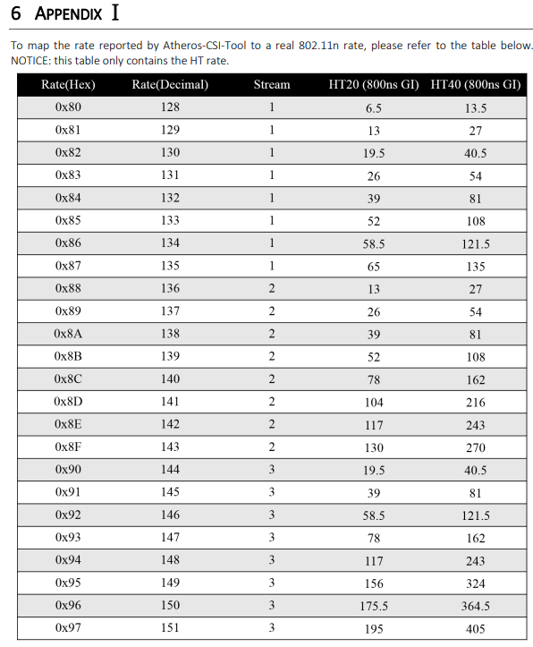

# Atheros CSI Tool

- [Atheros-CSI-Tool(v2)](https://github.com/wands-wireless/Atheros-CSI-Tool)
- [Atheros-CSI-Tool-UserSpace-APP(v2)](https://github.com/wands-wireless/Atheros-CSI-Tool-UserSpace-APP)
- [Guidance](https://github.com/xieyaxiongfly/Atheros_CSI_tool_OpenWRT_src/wiki)

## Usage (UserSpace-APP)

- sendData. You needs to set your PC as AP mode and another PC as client mode(This means that another PC needs to connect to SSID "Atheros_csi_tool").

    ```bash
    sudo ./send_Data wlan0 TARGET_MAC_ADDRESS 20 50 1000 # 20 packets, 50ms interval, 1000 payload length
    ```

- recvData.

    ```bash
    sudo ./recv_Data xxx.dat
    ```

## Tool Setting

If you successfully install the Atheros CSI Tool, hostapd can be started in `Atheros-CSI-Tool-UserSpace-App/hostapd-2.5/hostapd`. Type `iwconfig` you will see the `wlan0` status will change to this.

```bash
wlan0   IEEE 802.11abgn  Mode:Master  Tx-Power=15 dBm
        Retry short limit:7  RTS thr:off  Fragment thr:off
        Power Management:off
```

## Rate Configuration

The [issue[payload len: 1924 #22]](https://github.com/xieyaxiongfly/Atheros-CSI-Tool-UserSpace-APP/issues/22) on github shows that high bitrate will cause errors. Therefore, we need to change the rate lower manually.

The following commands can be used to display information about the radios and set the mcs bitrates.

- This will return supported MCS rate indexes.

    ```bash
    iw phy <phyname> info | grep "MCS rate indexes"
    ```

- The command below will set mcs-bit rate index. These indexes are given in Appendix 1 of the this [document](https://wands.sg/research/wifi/AtherosCSI/document/Atheros-CSI-Tool-User-Guide.pdf).

    ```bash
    iw dev <devname> set bitrates [mcs-<2.4|5> <MCS index>]
    ```

This [link](https://community.silabs.com/s/article/kba-linux-setting-wi-fi-tx-bitrate?language=en_US) will guide you how to configure 802.11n Wi-Fi Tx bitrate. The following picture is the reference setting correspond to Atheros rate indexes.



### Example AR9380

You will find a folder whose name is your `wlan0` mac address at following path. cat `your_mac_address/current_tx_rate` can check your rate setting.

```bash
cd /sys/kernel/debug/ieee80211/phy0/netdev:wlan0/stations
```

- Now we check the MCS rate indexes. You will find the total index number is equal to what _6 APPENDIX Ⅰ_ shows.

    ```bash
    iw phy phy0 info | grep "MCS rate indexes"
        HT TX/RX MCS rate indexes supported: 0-23
    ```

- We can change the bitrate now. According to the description of the issue, we set bitrate to `0x90`. You will find the `current_tx_rate` will be changed to `19.5 MBit/s`, which corresponds to the `HT20(800ns GI)` value. This setting also set the `Stream` to `3`.

    ```bash
    iw dev wlan0 set bitrates mcs-2.4 16
    ```

> I have test the rate `0x80` to `0x84`, `0x8E` to `0x91`. I found the most suitable rate should be `0x90`.
>
> Some tests failed, in which the rates contains `0x83`, `0x84`, `0x8E`, `0x8F`, `0x91`. My previous test has shown that `0x93` and `0x80` are also perform well.
>
> From my perspective, the rate higher that `26 MBit/s` will lead to unstable state of CSI data. The most obvious feature is the block length is greater than the file length. This is abnormal!
